# Challenge Twelve: Model-View-Controller - Tech Blog

## Project Description

Challenge Twelve required us to build an tech blog application where users can view others' tech-related posts, add comments to these posts, and create their own posts. This application followed the Model, View, Controller (MVC) design principle in which the application is divided into 3 components based on relative logic.

Model - Manages data, logic, and rules of application

View - Visually represents data to the client

Controller - Converts commands for the model or view 

[Source](https://en.wikipedia.org/wiki/Model%E2%80%93view%E2%80%93controller#Components)

This tech blog application uses MySQL as a database, Sequelize as an ORM, Express to manage server and routes, the express-session npm package to handle user authentification, and Handlebars for  templating. Additionally, Insomnia Core was used to test routes during development.  

### Application 

The following screenshots show the application and demonstrate some of its functionality. 

## Home Page (Logged Out)

When the user first opens the application, they are able to view existing posts, but cannot click on posts nor view the dashboard. 

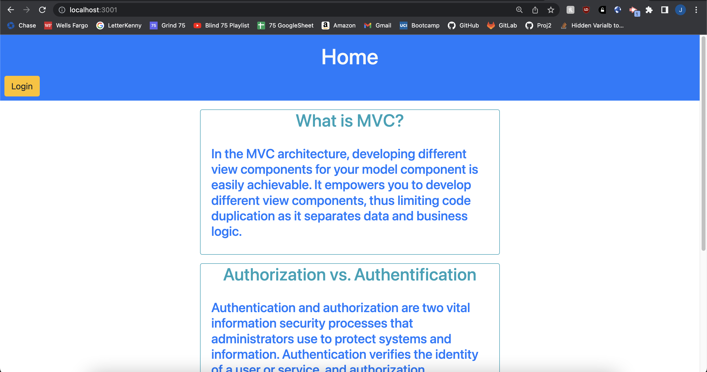

## Login

When the user clicks the 'Login' navigation button, they are taken the login page. If the user does not have an account they may register a new account.

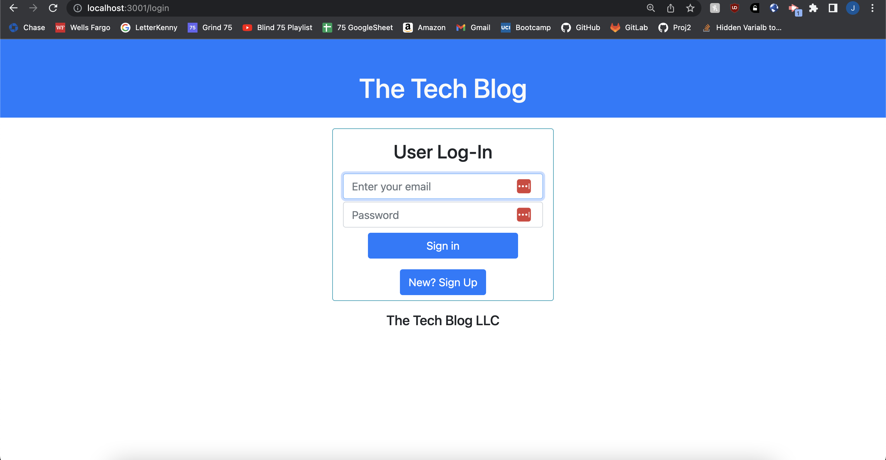
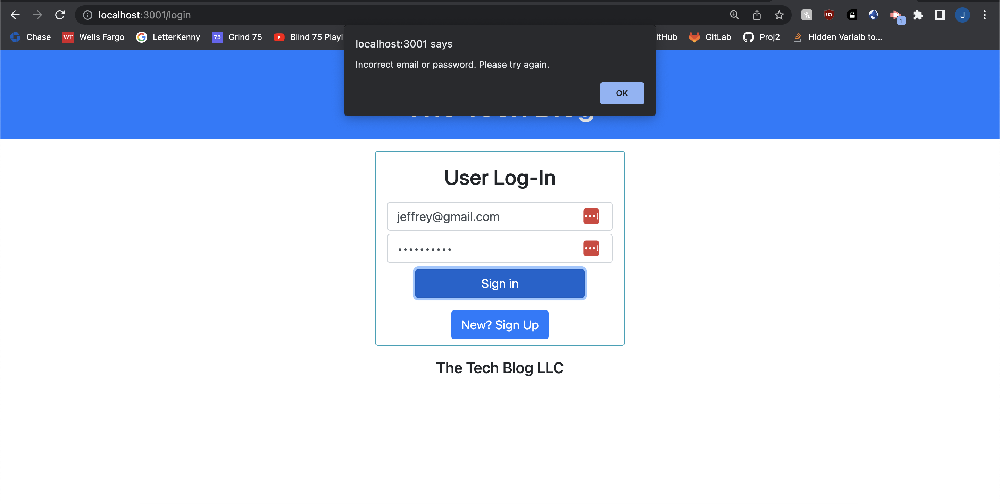

## Home Page (Logged In)

After registering an account, they are logged in and taken to the homepage. They may click on posts and have access to the 'Logout' and 'Dashboard' navigation buttons.

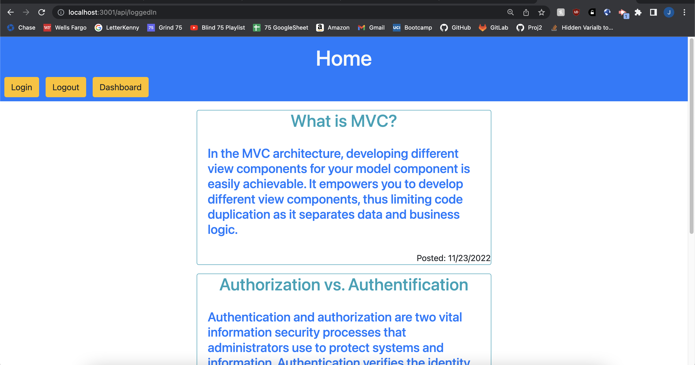

## View a Post

Now that the user is logged in, they may view click on existing posts. Once they do, they can view the author of the post, its comments, and the authors of the comments. 

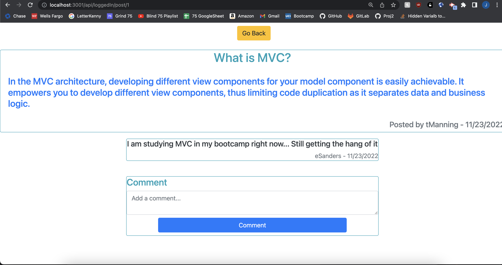

## Commenting

The user can add a comment to a post, update that comment, or delete it. The first image shows the post after the user writes a new comment. After clicking the 'Update' button, a text area appears for the user to type the updated comment. Once a comment is updated or deleted, the page refreshes and the changes are reflected.

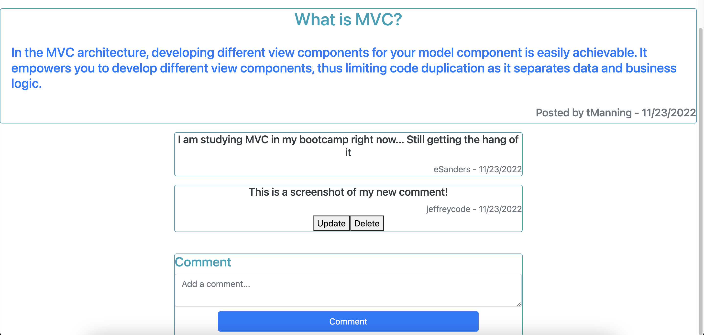
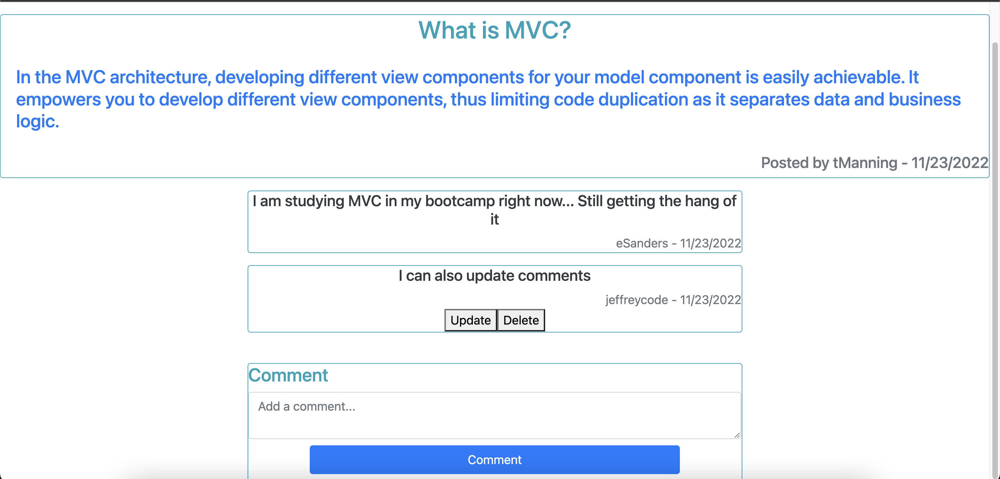

## Dashboard

The dashboard only contains posts that only the currrent user posted. After the user writes a post, they may click on it to update or delete it.
After a post is updated or deleted, the page refreshes and their dashboard reflects the changes made.

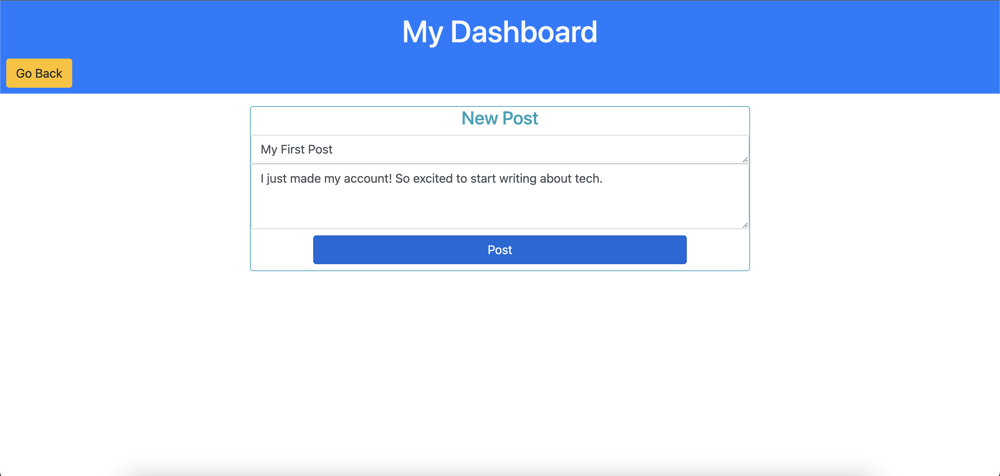
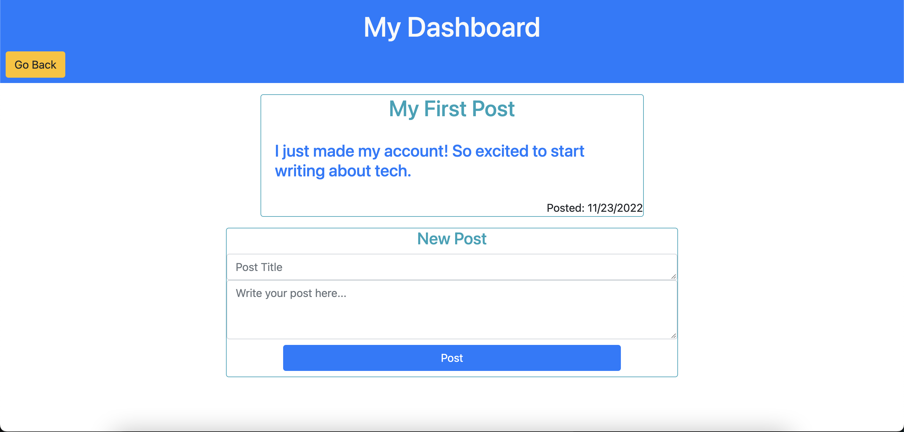
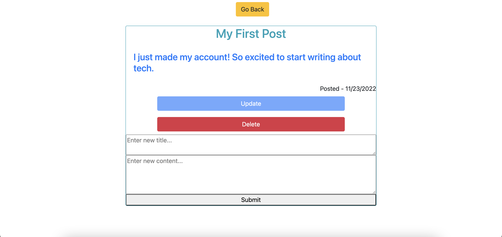
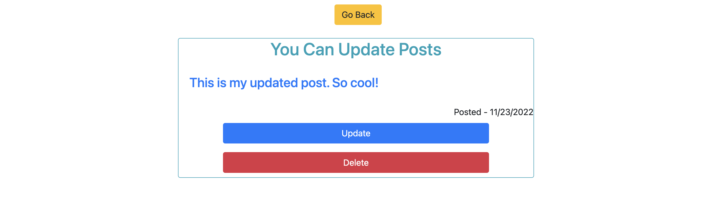

## Logout

The user may log out with the 'Log Out' button. Afterwards, they are logged out, they are back the homepage and are unable to click into posts or navigate to the dashboard.

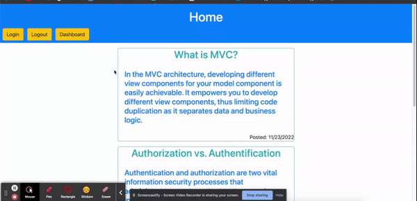

## Heroku Update Comment Session Delay Bug

The deployed Heroku application experiences delay in recognizing the user's session. The application uses the user's session to recognize which comments belong to the user and renders an update and delete button to their comments. Unfortunately, since the session takes time to save user info to the session, these buttons don't instantly appear on the Heroku app after signing in. Below is a video demonstrating this functionality on the local server. I log in, view a post, view the update and delete buttons with my comments, and then update and delete these comments. 

When demo'ing the Heroku, please wait about 5-10 minutes for these update and delete buttons to render on your comments.

[Update and Delete Heroku Session Bug](https://drive.google.com/file/d/18I8r75B9hF2ORcCUw8NplNJkrNVAKoKk/view)

### Link to Github Repository
[https://github.com/jffsun/chall-twelve-tech-blog](https://github.com/jffsun/chall-tech-blog)

### Link to Deployed Heroku Application
[https://glacial-castle-86468.herokuapp.com/](https://glacial-castle-86468.herokuapp.com/)