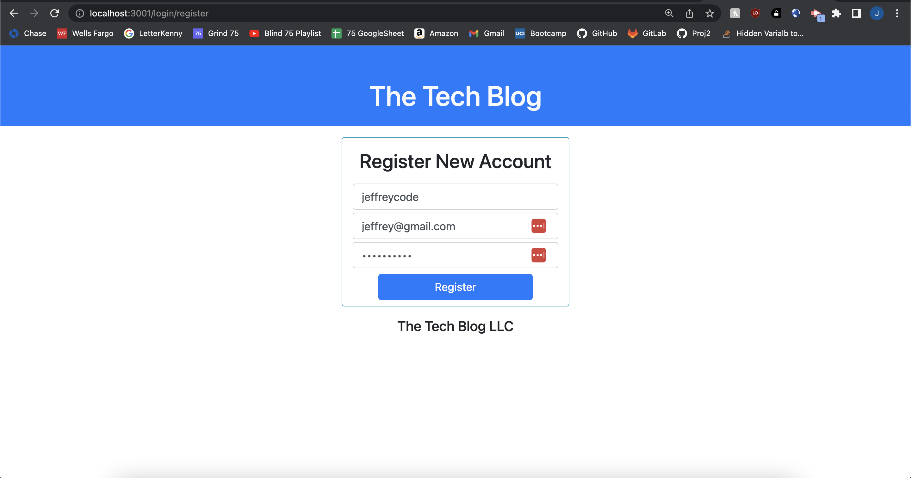

# Challenge Twelve: Model-View-Controller - Tech Blog

## Project Description

Challenge Twelve required us to build an tech blog application where users can view others' tech-related posts, add comments to these posts, and create their own posts. This application followed the Model, View, Controller (MVC) design principle in which the application is divided into 3 components based on relative logic.

Model - Manages data, logic, and rules of application

View - Visually represents data to the client

Controller - Converts commands for the model or view 

[Source](https://en.wikipedia.org/wiki/Model%E2%80%93view%E2%80%93controller#Components)

This tech blog application uses MySQL as a database, Sequelize as an ORM, Express to manage server and routes, the express-session npm package to handle user authentification, and Handlebars for  templating. Additionally, Insomnia Core was used to test routes during development.  

### Application 

The following screenshots show the application and demonstrate some of its functionality. 

## Home Page (Logged Out)

When the user first opens the application, they are able to view existing posts, but cannot click on posts nor view the dashboard. 

## Login

When the user clicks the 'Login' navigation button, they are taken the login page. If the user does not have an account they may register a new account.

## Home Page (Logged In)

After registering an account, they are logged in and taken to the homepage. They may click on posts and have access to the 'Logout' and 'Dashboard' navigation buttons.

## View a Post

Now that the user is logged in, they may view posts, the creator of the posts, and its comments. 

## Commenting

The user can add a comment to a post, update that comment, or delete it.

## Dashboard

In the dashboard, are posts that only the currrent user posted. After the user writes a post, they may click on it to update or delete it.

### Link to Github Repository
[https://github.com/jffsun/chall-eleven-ecommerce](https://github.com/jffsun/chall-eleven-ecommerce)